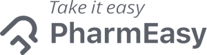

# 💊 MediStats — Smart Medicine Price Comparison Platform

[](https://react.dev/)
[](https://vitejs.dev/)
[](https://www.framer.com/motion/)
[](https://reactrouter.com/)
[](#license)

> **"Say Goodbye to high medicine prices — Compare prices and save up to 51%."**  
> MediStats acts as the **"Trivago of Online Pharmacies"**, enabling consumers to search for essential medications and instantly compare prices across major Indian e-pharmacies (**Tata 1mg**, **PharmEasy**, and **Netmeds**) to find the best deals.

---

## 📌 Table of Contents
- [Overview](#-overview)
- [Key Features](#-key-features)
- [Supported E-Pharmacies](#-supported-e-pharmacies)
- [Tech Stack](#-tech-stack)
- [Project Architecture & Directory Structure](#-project-architecture--directory-structure)
- [Pages & Routing](#-pages--routing)
- [Getting Started](#-getting-started)
- [API & Backend Connectivity](#-api--backend-connectivity)
- [Future Roadmap](#-future-roadmap)
- [Author & Acknowledgements](#-author--acknowledgements)

---

## 🔍 Overview

In the healthcare sector, prescription drug prices can vary significantly between different online retailers. Finding the lowest price usually requires checking multiple websites individually, which is tedious and confusing.

**MediStats** solves this by:
1. Aggregating pricing, packaging, and availability across leading pharmacy platforms in real-time.
2. Presenting users with direct price comparisons, MRP savings, and substitute generic options.
3. Offering a **Smart Cart** that calculates total order costs across vendors to recommend the optimal purchase package.

Originally developed as an engineering **Mini Project (1st Year MPR)**, MediStats combines an intuitive UI with fluid animations to deliver a seamless healthcare shopping experience.

---

## ✨ Key Features

### 🔎 Intelligent Search & Prefetching
- **Interactive Search Hero**: Features an animated typing/cycling placeholder highlighting popular remedies (*Dolo, Crocin, Aspirin, Paracetamol, Ibuprofen, Cetrizine, etc.*).
- **Hover-Triggered Prefetching**: Prefetches live search data from the backend when users hover over the search button, drastically reducing perceived latency.

### ⚖️ Multi-Vendor Price Comparison
- Side-by-side comparison cards displaying the price, MRP, discount percentage, seller platform, and direct links to purchase directly on the vendor store.
- Instant calculation of savings relative to maximum retail price (MRP).

### 📋 Detailed Medicine Pages (`/details/:medicinename`)
- Detailed drug profiles including brand name, manufacturer (e.g., Micro Labs Ltd, Cipla, Alembic), packaging specifications, and active chemical composition (e.g., *Paracetamol / Acetaminophen 650mg*).
- Interactive strength and packaging variant toggles.
- Real-time comparison table of vendor pricing with direct checkout links.

### 🛒 Smart Cart & Package Deal Optimizer (`/cart`)
- Add items, adjust quantities, and view live totals.
- **Best Single-Item Deal**: Identifies which platform offers the lowest unit cost for individual items.
- **Package Deal Calculator**: Computes full cart totals for each vendor (*1mg*, *Netmeds*, *PharmEasy*) and marks the **Best Value** platform for the entire order, helping users avoid multiple shipping fees.

### 🩺 Medicine Catalog & Exploration (`/explore`)
- Curated showcase of common medicines categorized by badges such as **"Best"** and **"Cheapest"**.
- Transparent display of generic substitute discounts.

### 🔐 User Authentication & Profile (`/login`, `/signup`, `/profile`)
- Global authentication context (`AuthContext`) managing login sessions and navigation guards.
- User profile page rendering avatar and account information.

---

## 🏬 Supported E-Pharmacies

| Platform | Logo | Service Focus |
|---|---|---|
| **Tata 1mg** |  | Online pharmacy, diagnostics, and doctor consultations |
| **PharmEasy** |  | Medicine delivery and healthcare essentials |
| **Netmeds** |  | Prescription medicines and wellness products |

---

## 🛠️ Tech Stack

- **Frontend Core**: [React 18](https://react.dev/) + [Vite](https://vitejs.dev/) (Fast HMR & build tooling)
- **Routing**: [React Router DOM v6](https://reactrouter.com/) (Browser router, nested routes, route parameters)
- **Styling**: Vanilla CSS Modules (`*.module.css`) for modular, collision-free styles
- **Motion & Micro-interactions**: [Framer Motion](https://www.framer.com/motion/) (Transitions, enter animations, stagger effects)
- **Iconography**: [Lucide React](https://lucide.dev/) & [React Icons](https://react-icons.github.io/react-icons/)
- **Scroll Observer**: `react-intersection-observer` (Scroll-triggered animations)
- **State Management**: React Context API (`AuthProvider`, `PrefetchProvider`)

---

## 📂 Project Architecture & Directory Structure

```text
Medistats/
├── public/                 # Static public assets
├── src/
│   ├── assets/             # Brand logos (1mg, Netmeds, PharmEasy) & medicine visuals
│   ├── Components/         # Reusable UI components
│   │   ├── Footer/         # Global site footer
│   │   ├── Medicards/      # Reusable medicine card with pricing & discount badges
│   │   └── Navbar/         # Responsive navigation bar with auth & cart indicators
│   ├── Context/            # React Context providers
│   │   ├── AuthProvider.jsx      # Authentication state and login/logout handlers
│   │   └── PrefetchedContext.jsx # Shared prefetch state for fast search results
│   ├── Pages/              # Page views
│   │   ├── AboutUs/        # Mission, company info, and contact details
│   │   ├── Cart/           # Smart Cart & multi-vendor package deal optimizer
│   │   ├── ExploreMedicines/# Catalog of popular medicines with filters
│   │   ├── Landing Page/   # Hero section, feature highlights, popular medicines carousel
│   │   ├── MedicineDetails/# Drug profile, composition, strength, and vendor links
│   │   ├── Profile/        # Logged-in user profile view
│   │   ├── SearchMedicines/# Multi-vendor search result comparison grid
│   │   └── User/           # Login and Signup forms
│   ├── App.jsx             # Router configuration & top-level layout wrappers
│   ├── Layout.jsx          # Shared navbar & footer layout wrapper
│   ├── index.css           # Global typography, color variables, and resets
│   └── main.jsx            # Application entry point
├── eslint.config.js        # ESLint flat configuration
├── index.html              # HTML entry template
├── package.json            # Dependencies and npm scripts
└── vite.config.js          # Vite build and plugin setup
```

---

## 🚦 Pages & Routing

| Route | Component | Description |
|---|---|---|
| `/` or `/home` | `LandingPage` | Animated hero search, partner platforms, feature highlights, and popular medicines |
| `/explore` | `ExploreMedicines` | Catalog of medicines with tags (*Best*, *Cheapest*) and price comparisons |
| `/search/:medicinename` | `SearchResults` | Multi-vendor price comparison table for queried medicine |
| `/details/:medicinename`| `MedicineDetails` | Comprehensive medicine specs, composition, dosage, and vendor purchase links |
| `/cart` | `CartPage` | Cart management with package deal comparison across 1mg, Netmeds, and PharmEasy |
| `/about` | `AboutUs` | Project overview, mission, core values, and contact channels |
| `/login` | `Login` | User sign-in interface integrated with backend authentication |
| `/signup` | `Signup` | User registration interface |
| `/profile` | `ProfilePage` | User dashboard displaying account details |

---

## 🚀 Getting Started

### Prerequisites
- [Node.js](https://nodejs.org/) (v16.0 or higher recommended)
- `npm` or `yarn`

### Installation

1. **Clone the repository**:
   ```bash
   git clone https://github.com/Devanshnair/Medistats.git
   cd Medistats
   ```

2. **Install dependencies**:
   ```bash
   npm install
   ```

3. **Start the local development server**:
   ```bash
   npm run dev
   ```

4. **Open in browser**:
   Navigate to `http://localhost:5173` (or the port specified in terminal).

### Available Scripts

- `npm run dev`: Starts Vite dev server with Hot Module Replacement (HMR).
- `npm run build`: Compiles production-ready bundle into `dist/`.
- `npm run preview`: Previews the production build locally.
- `npm run lint`: Runs ESLint to verify code quality.

---

## 🌐 API & Backend Connectivity

The frontend connects to a REST backend service (configured in `src/App.jsx` via `baseURL`):
- `POST /api/search/` — Queries real-time price data across configured pharmacy platforms.
- `POST /api/auth/accounts/login/` — Authenticates user credentials.
- `POST /api/auth/accounts/signup/` — Registers new user accounts.

> *Note: If running against a local or private backend, update `baseURL` in [src/App.jsx](src/App.jsx) or configure a `.env` variable (`VITE_API_BASE_URL`).*

---

## 🗺️ Future Roadmap

- [ ] **Prescription Upload (OCR)**: Automatically parse uploaded doctor prescriptions to query entire medicine lists.
- [ ] **Generic Alternative Suggester**: Direct recommendation of lower-cost bioequivalent generics.
- [ ] **Price Drop & Restock Alerts**: Email or push notifications when target medicines go on sale.
- [ ] **Nearby Pharmacy Availability**: Integration with local brick-and-mortar pharmacies using location APIs.
- [ ] **Order Tracking & Unified Checkout**: One-click checkout integration.

---

## 👨‍💻 Author & Acknowledgements

- **Author**: Devansh Nair ([@Devanshnair](https://github.com/Devanshnair))
- **Project Context**: 1st Year Mini Project (MPR)
- **Inspiration**: Bridging transparency and affordability in online healthcare commerce.

---

## 📄 License

This project is licensed under the [MIT License](LICENSE).
